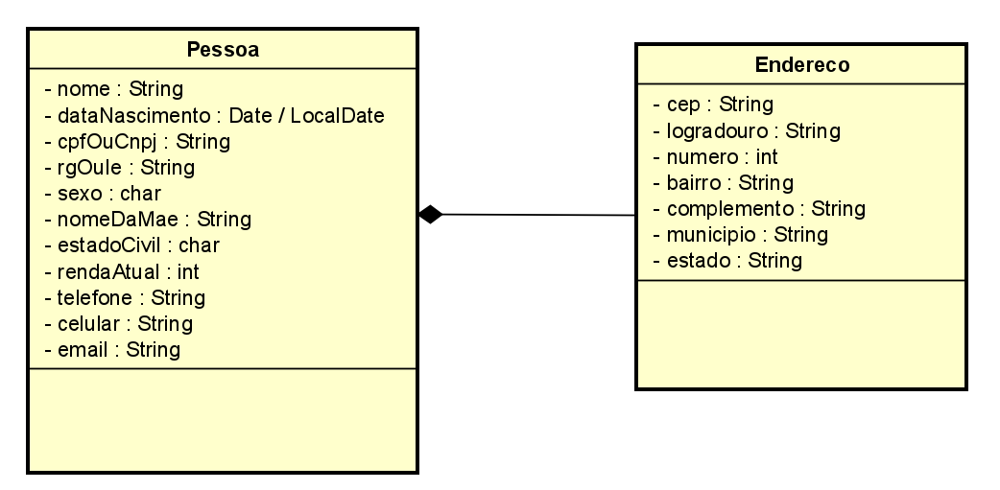

# 🌱 Conta Rural
Repositório da implementação do projeto Conta Rural, proposto na mentoria do Digytal Space. O readme completo do desafio está disponível <a href="https://github.com/glysns/conta-rural" target="_blank">aqui.</a>

### Itens de avaliação ao longo dos estudos
* conhecimento e domínio dos fundamentos e recursos da linguagem escolhida (no caso, Java);
* noções do paradigma da orientação a objetos e os pilares da POO;
* compreensão quanto à leitura e escrita de documentos nos formatos: `.json`, `.csv`, `.xls`;
* interpretação de layouts de documentos como delimitado e posicional;
* engajamento com persistência de dados relacional de forma nativa ou utilizando algum framework ORM;
* configuração e controle de envio de e-mails;
* noções de arquitetura HTTP com base na linguagem e framework escolhido;
* conceito sobre níveis de maturidade dos recursos HTTP;
* prover os recursos da sua aplicação através de uma arquitetura REST;
* implementação de clientes HTTP;
* desenvolvimento de interfaces gráficas como desktop, web e mobile;
* integração entre aplicações

<h2> Fase 1 - conceitos estudados </h2>
<ul>
  <li>orientação a objetos;</li>
  <li>noções de UML;</li>
  <li>tipos de dados;</li>
  <li>escrita e leitura em arquivos.</li>
</ul>
<h2> Resolução</h2>
<h3>1. Diagrama UML</h3>

<h4><i>1.1 Pensando classes e relacionamento</i></h4>

O primeiro passo foi modelar as classes do projeto, e a primeira entidade que fez sentido para mim foi `Pessoa`, que terá todos os atributos referentes aos dados pessoais dos clientes, incluindo o endereço. Como o endereço é composto por uma série de outros atributos, também fez sentido pensar nele como uma classe à parte, ainda que relacionada com a classe `Pessoa`. 

Já que uma pessoa **tem** um endereço, podemos dizer que a **relação** entre a classe `Pessoa` e a classe `Endereço` é de **composição**, representada no diagrama UML por uma linha com um losango ou diamante preenchido. A composição é uma variação mais específica da agregação, e indica uma dependência de ciclo de vida mais forte entre as classes. No nosso caso, se o registro de uma pessoa for apagado, queremos que o endereço associado a essa pessoa também seja excluído. Assim, podemos perceber que a entidade `Endereço` depende fortemente da entidade `Pessoa`, só há endereço se houver pessoa. Lembrando que isso dentro deste contexto em especial, ou pelo menos o modo como eu interpretei as "regras de negócio" desse projeto em particular.

<figure>
  
  <figcaption>Figura 1 - Diagrama de classes Pessoa e Endereço (feito no Astah)</figcaption>
</figure>

<h4><i>1.2 Pensando tipos de dados</i></h4

Outro detalhe são os tipos de dados de cada atributo. Para a maioria pensei em String, para armazenar texto como nome e nome da mãe. Além disso, também coloquei CPF, RG, telefone, CEP, etc. como String, porque além de não serem números envolvidos em operações matemáticas, eles podem começar com zero. Se fosse mantido um tipo numérico como Integer, Long, etc., o número zero do começo provavelmente seria ignorado pela linguagem de programação e causaria problemas. Assim, os únicos campos que realmente ficaram com um tipo de dado numérico foi a `renda atual` da classe `Pessoa`.

O campo `sexo` ficou com o tipo `char`, pois receberá valores como `M` ou `F` (ou `N`, pensando em pessoas não-binárias), assim como o `estado civil`, que também receberá apenas uma letra (S para solteiro, C para casado, etc.). Por fim, o atributo `data de nascimento` ficou com o tipo `Date` (no caso de banco de dados) ou `LocalDate` (já focando na linguagem Java), pois é um tipo mais específico e que permite trabalhar com recursos mais adequados para datas.

<h3>2. Estrutura do projeto Java</h3>
Seguindo padrão de estrutura de diretórios - ou pacotes - da linguagem Java, vamos nomear o pacote mais genérico com o domínio da organização ao contrário. Supondo que o site do projeto seja `www.digytalspace.com.br`, e o nome do projeto em si seja "conta rural", o pacote ficaria: `br.com.digytalspace.contarural`.
A classe principal do projeto é a que tem o método `main`; optei por nomear como `CadastroApp.java`, e deixar no pacote principal. 
Em seguida, pensando que temos duas classes que são o reflexo das entidades, ou seja, das tabelas (no banco de dados), criei um pacote chamado `entities` e coloquei as classes `Pessoa` e `Endereco` dentro.
Para armazenar a classe com os métodos de ler e escrever arquivos, achei uma boa criar um pacote chamado `util`. A classe com os métodos teria o mesmo nome, indicando que é uma classe com métodos auxiliares. Nesse mesmo pacote coloquei a classe `PadroesBacen`, que conterá métodos para formatar os campos de acordo com o requisito dos padrões Bacen.
A estrutura dos pacotes ficou assim: 
<figure>
  
  <figcaption>Figura 2 - Estrutura de pacotes do projeto</figcaption>
</figure>
